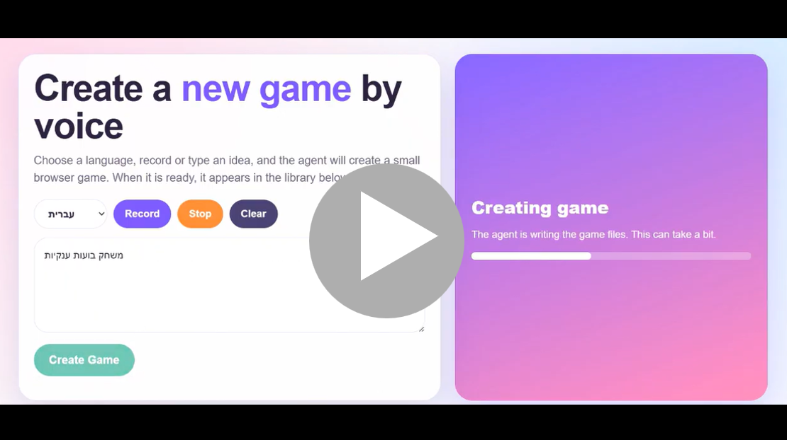

# Voice-to-Game AI Agents

A multilingual AI agent platform that turns voice or text prompts into playable browser games for children.

The platform receives a game idea from the user, generates a complete browser-based game, saves it as a versioned project, and makes it available through a visual game library.

The system is built as an agentic workflow, where each agent is responsible for a specific stage in the game creation lifecycle.

## Demo Video

This demo shows how a user can describe a game idea, generate a playable browser game, save it as a new version, and open it from the game library.

[](https://youtu.be/ffYAiedReDo)

## Overview

Voice-to-Game Agents allows users to create games using natural language.

The user can describe a game idea using text or voice, and the agent generates a complete static browser game.

Each generated game includes:

```text
index.html
style.css
script.js
optional image assets
````

The games run directly in the browser and can also be deployed using GitHub Pages.

The platform supports:

```text
Create Game
Edit Game
Play Game
Game Library
Multilingual Input
Optional Image Generation
Git Publishing
```

## Key Features

* Generate browser games from text prompts
* Generate browser games from voice input
* Support multilingual game creation
* Support Hebrew and English input
* Generate complete HTML, CSS, and JavaScript files
* Save each game as a versioned folder
* Edit existing games without deleting previous versions
* Display generated games in a visual game library
* Open each game in Play mode or Edit mode
* Support optional Git publishing
* Support GitHub Pages deployment
* Reduce cost by limiting text-to-image generation
* Use CSS shapes, colors, gradients, and animations for most visual elements

## Multilingual Support

The platform supports multilingual input for game creation.

Users can describe game ideas in Hebrew or English using either text or voice input.

```text
Supported input languages:
- English
- Hebrew
```

The generated code remains in English for maintainability.

The game content itself can be adapted to the requested language.

Example Hebrew request:

```text
צור משחק יום הולדת לילדה בת 3.
הילדה צריכה ללחוץ על בלונים, לאסוף מתנות ולקשט עוגה.
```

Example English request:

```text
Create a birthday game for a 3-year-old child.
The child should click balloons, collect gifts, and decorate a cake.
```

The same agent workflow can process both requests and generate a playable browser game.


## Cost-Aware Image Generation

The platform is designed to reduce unnecessary calls to text-to-image models.

Instead of generating many images for every game, the system limits each game to a maximum of 2 generated images.

```text
Maximum generated images per game: 2
```

This keeps the platform cheaper, faster, and easier to scale.

Typical image usage:

```text
Image 1: main background or scene
Image 2: main character or important object
```

All other visual elements should be created with HTML and CSS.

Examples:

```text
CSS circle    -> balloon
CSS square    -> gift box
CSS triangle  -> house roof
CSS gradient  -> sky or background
CSS button    -> interactive object
CSS animation -> movement or celebration
```

For example, a birthday game can use:

```text
1 generated cake image
1 generated background image
CSS balloons
CSS gifts
CSS stars
CSS buttons
CSS confetti animation
```

This approach keeps the game colorful and engaging while avoiding unnecessary image-generation cost.

## Agent Architecture

The platform is implemented as a multi-stage agent workflow.

Each agent has a clear responsibility and passes its output to the next stage.

```text
User text or voice request
        |
        v
Input Agent
        |
        v
Repository Agent
        |
        v
Image Asset Agent
        |
        v
Game Code Generation Agent
        |
        v
Validation Agent
        |
        v
Versioning and Storage Agent
        |
        v
Publishing Agent
        |
        v
Game Library UI
```

## Current Workflow

The current workflow follows this structure:

```text
START
  |
  v
prepare_paths
  |
  v
generate_images
  |
  v
generate_files
  |
  v
save_files
  |
  v
publish_to_git
  |
  v
END
```

## Agents

### 1. Input Agent

Receives the user request from text or voice input and passes the game idea into the workflow.

### 2. Repository Agent

Validates the repository path, creates the `games/` folder, and prepares create or edit mode.

### 3. Image Asset Agent

Optionally generates up to 2 images and encourages the use of CSS shapes, colors, and animations for the rest of the game.

### 4. Game Code Generation Agent

Generates the full playable browser game using `index.html`, `style.css`, and `script.js`.

### 5. Edit Agent

Loads an existing game and applies the requested changes without deleting previous versions.

### 6. Validation Agent

Checks generated files and image paths to reduce broken outputs and invalid asset references.

### 7. Versioning and Storage Agent

Saves every generated or edited game as a versioned folder inside `games/`.

### 8. Publishing Agent

Optionally commits and pushes the generated game to Git for GitHub Pages deployment.

### 9. Game Library Agent

Scans the `games/` folder and displays generated games in a visual library with Play and Edit options.

## Game Library

The Game Library provides a visual interface for browsing generated games.

Instead of opening folders manually, users can view all generated games in one place.

Each game can be opened in two modes:

```text
Play Game
Edit Game
```

This makes the platform easier for children because they can choose games visually instead of reading folder names or technical file paths.

Suggested flow:

```text
Open Game Library
        |
        v
Choose a game card
        |
        v
Play Game or Edit Game
```

The library can scan the `games/` folder and display each generated game as a card.

Each card can include:

```text
Game title
Preview image or simple visual placeholder
Play button
Edit button
Version/folder name
```


## Docker Support

The platform can run inside Docker, making the environment reproducible and easy to deploy.

Docker is used to package the Python agent workflow, dependencies, environment configuration, and game generation runtime into a single container.

This makes it easier to run the project consistently across local machines, demos, and cloud environments.

